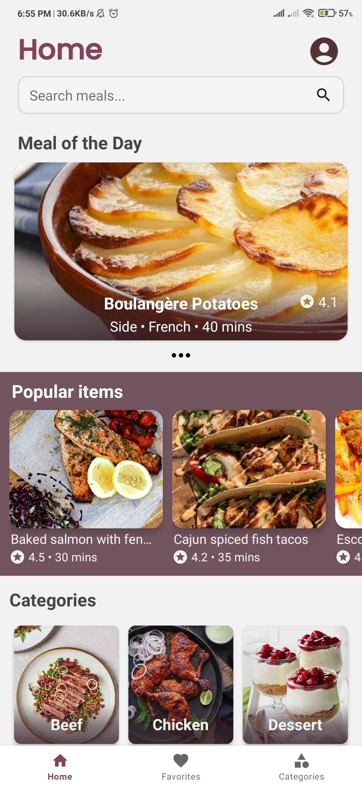
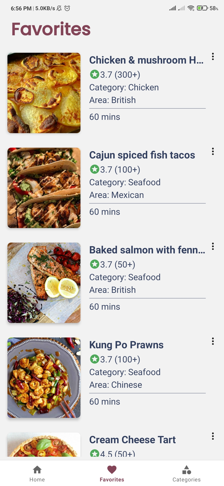

# Foodzy - Recipe App

Foodzy is an Android recipe app built using Kotlin that allows users to explore a wide range of recipes from various cuisines. The app fetches recipe data from TheMealDB API using the Retrofit library and features a beautiful and user-friendly UI. One of the key features of Foodzy is the favorite section, which enables users to save their preferred recipes for offline access, thanks to the Room library. The app follows the MVVM architecture to maintain a clean and organized codebase.

## Features

- 🍳 Browse a vast collection of recipes from different cuisines.
- 🔍 Search for specific recipes based on ingredients or names.
- ⭐ Save your favorite recipes to access them offline.
- 🎨 Enjoy a visually appealing and user-friendly UI design.
- 🏗️ Follows the MVVM architecture for a well-organized app structure.
- 🌐 Utilizes Retrofit for seamless integration with the recipe API.
- 🗄️ Implements Room for offline storage of favorite recipes.

## Screenshots

## Technical Details

- **Minimum Android SDK:** Android 5.0 (Lollipop)
- **Language:** Kotlin

## Dependencies

- [Retrofit](https://square.github.io/retrofit/): A type-safe HTTP client for Android and Java.
- [Room](https://developer.android.com/training/data-storage/room): An abstraction layer over SQLite to allow for more robust database access.
- [Glide](https://bumptech.github.io/glide/): A fast and efficient image loading library for Android.

## Installation
Follow the Gdrive link to install the application - 

## Contact
If you have any questions, suggestions, or feedback regarding the Foodzy Recipe App, please feel free to contact me:

Email: kumar.bgp.niraj@gmail.com
LinkedIn: www.linkedin.com/in/nirajk24
Thank you for your interest in Foodzy! I hope you find the app helpful and enjoyable. Happy cooking!

